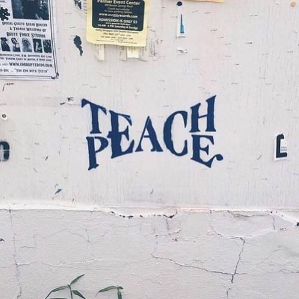

### 字体设计 ###

**标出每张图片给出自己什么灵感**

毛笔字体笔刷和笔触以及其他字体

**链接：[https://pan.baidu.com/s/1ggObHKZ ](https://pan.baidu.com/s/1ggObHKZ)**

密码：42gq

#### **pic1：** ####

字体的缩放，在PS中是单一的方向，没有往中间走的，这里面的想法是，可以复制一个图层进行操作，然后两个图层叠加，就可以了。

